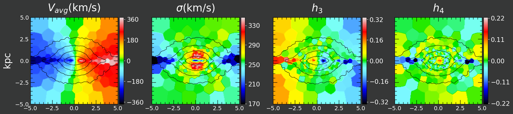
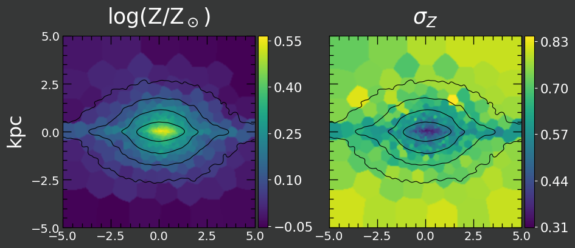
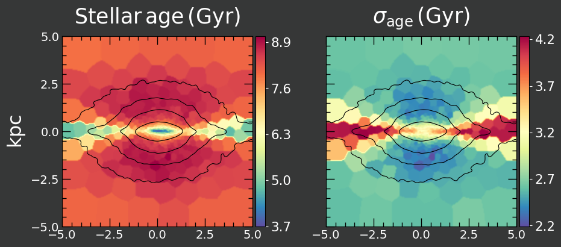

# voronoi_gadget
<table>
  <tr>
    <td colspan="2">Stellar kinematics example</td>
  </tr>
  <tr>
    <td colspan="2"></td>
  </tr>

  <tr>
    <td>Stellar metallicity example</td>
    <td>Stellar age example</td>
  </tr>
  <tr>
    <td></td>
    <td></td>
  </tr>
 </table>

## Description
Creates mock integral field unit (IFU) galaxy images from galaxy simulations, like the one shown above. 
Each Voronoi bin (spaxel) contains roughly the same number of simulation particles in projection. 
This simulates the signal-to-noise criterion used in real IFU maps to determine the bin shape and size.
For a given Voronoi grid any quantity stored or derivable from the snapshot (line-of-sight velocity, metallicity, stellar age) can be plotted.
In the case of velocity maps, it calculates the higher order moments h_3 and h_4 with a Gauss-Hermite fit, in addition to mean and dispersion.

The code uses the [pygad](https://bitbucket.org/broett/pygad) library to open simulation snapshots, 
meaning it supports natively Gadget and Arepo simulations, but it can also be used on 
other formats with some tweaking.

It also uses the [vorbin](https://pypi.org/project/vorbin/) package by Michele Cappellari for creating the Voronoi grid, 
therefore any paper using this should cite [Cappellari & Copin 2003](http://adsabs.harvard.edu/abs/2003MNRAS.342..345C).

## Install:
```bash
git clone https://github.com/mafrigo/voronoi_gadget.git
cd voronoi_gadget
pip install .
```

## Usage example:
```python
import voronoi_gadget as vg

# Load a gadget snapshot file into a snap object with pygad (angle=90: edge-on, angle=0: face-on).
snap = vg.openfile(filename, subsnap="stars", angle=90)
# Note: for more advanced plots, the snapshot should be opened and oriented with pygad directly.

# Create a Voronoi grid for this snapshot with extent 4 kpc
grid = vg.VoronoiGrid(snap, 4., npixel_per_side=200, nspaxels=500)

# Plot the desired quantity (line of sight kinematics) on the grid
grid.plot_qty("vel", cmap='sauron', style="darkblurred")
# Note: coordinate 1 (intermediate axis if oriented edge-on) is used as line of sight.

# Plot stellar metallicity on the same grid
grid.plot_qty("ZH", cmap='viridis', style="darkblurred")

# Plot age on the same grid
grid.plot_qty("age", cmap='Spectral_r', style="darkblurred")
```
You can see the outputs of this script in the example_output folder (and at the beginning of this README).

## Configuration instructions

There are two config files in the package installation folder, style_config.yaml and plot_config.yaml. 
The file location is printed out whenever it gets loaded.

### style_config.yaml
Contains configuration settings about the plot style, e.g. font sizes and colors. Each key defines a style, which is
used in ```grid.plot_qty()``` (see example above). If an option is not specified for the chosen key, the default option 
(defined in the "default" key at the end of the file) will be used.

### plot_config.yaml
Contains configuration settings about labels and colorbar settings for each specific quantity that can get plotted. Like
in style_config.yaml, unspecified options default to the "default" key.

## Usage in literature:
* Frigo et al. 2021 (https://ui.adsabs.harvard.edu/abs/2021MNRAS.508.4610F/abstract)

* Neureiter et al. 2021 (https://ui.adsabs.harvard.edu/abs/2021MNRAS.500.1437N/abstract)

* Frigo et al. 2019 (https://ui.adsabs.harvard.edu/abs/2019MNRAS.489.2702F/abstract)

* Rantala et al. 2019 (https://ui.adsabs.harvard.edu/abs/2019ApJ...872L..17R/abstract)

* Rantala et al. 2018 (https://ui.adsabs.harvard.edu/abs/2018ApJ...864..113R/abstract)

* Lahén et al. 2018 (https://ui.adsabs.harvard.edu/abs/2018MNRAS.475.3934L/abstract)
